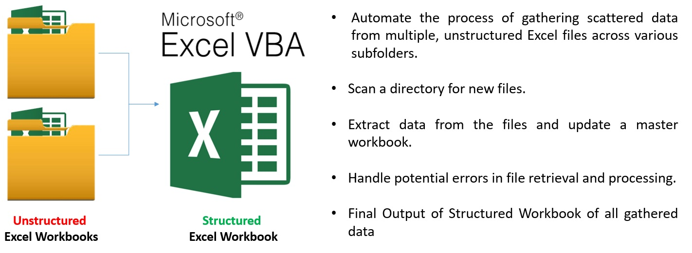

# Excel VBA Report Project
## Data-Extraction-VBA 
This project automates the process of gathering and processing report files using Excel VBA. It scans a folder and its subfolders for specific report files, extracts data from them, and updates an Excel workbook accordingly.

<table border="1" style="border-collapse: collapse; width: 100%;">
  <tr>
    <td>
      
    </td>
    <td>
      
    </td>
  </tr>
</table>

## Table of Contents
- [Project Overview](#project-overview)
- [Features](#features)
- [Project Structure](#Project-Structure)
- [How to Use](#how-to-use)
- [How to Contribute](#how-to-contribute)
- [License](#license)


## Project Overview

This project is designed to automate the process of loading report files from various directories and then updating an Excel workbook. The two main VBA functions are:
- **Get_rest_file**: Scans the specified folder and subfolders for new report files.
- **Update_WB_link**: Updates links in the Excel workbook with data from the new files.

## Features

- Recursively scans folders and subfolders for specific files.
- Retrieves file data and updates the main workbook.
- Updates external file links in the workbook.
- Automatic error handling for missing files and data.
- Updates the workbook’s "Data" sheet with the latest file paths.
  
## Project Structure:
- **[VBA-Scripts Folder](./VBA-Scripts/)**: Contains all VBA modules and macros.
- **[data Folder](./data/)**: Includes Excel files and data needed for the VBA macros (if applicable).
- **[Documentation Folder](./Documentation/)**: Detailed documentation, including project setup, steps, and usage.

## How to Use

1. **Clone the repository** to your local machine:
   ```bash
   git clone https://github.com//mahmoudmyusuf/Data-Extraction-VBA.git


## How to Contribute:
If you'd like to contribute:
1. Fork the repository.
2. Make your changes to the VBA scripts.
3. Create a pull request with a clear description of your changes.

Please ensure that any contributions follow the project's coding style and include comments where necessary.

## **[Final Documentation](./Documentation/)**:
For detailed steps, analysis, and methodology, please refer to the [Final Documentation](./Documentation/StepsDocumentation.md) file.

## License:
This project is a personal project and is free to use for personal, educational, and non-commercial purposes.
